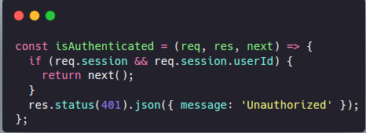

# React + Express Session based auth demo

Hey there! I am **Swayam**. My friend wanted to understand how session based auth works, so I made this demo. I tried to cover a fair amount of beginner doubts and the things even I had to ask gpt

I hope you will master session based auth from this demo.

## What are we implementing?

1. User visits the site
2. User clicks login
3. User is redirected to the login page
4. User logs in
5. User is redirected to the home page
6. User logs out
7. User is redirected back to login page

- **Redirect Logic:**
  - If the user is **already logged in**, they should be redirected to the **home page** when attempting to access the **login page**.
  - If the user is **not logged in**, they should be redirected to the **login page** when trying to access protected pages, such as the **home page**.

## How it works under the hood?

On a higher level, we make an express server, and on signup, we first make sure the email isn't already registered in db. If it is, we return an error. If it isn't, we create a user in the database and login the user.

On login, we first check if the user exists in db. If they do, we check if the password is correct. If it is, basically login the user

## Logging in the user means?

Logging in a user involves creating a session in the database. We generate a unique session ID and store it there. Additionally, we create a cookie in the user's browser that holds this session ID.

When the user visits the site, we check if the session ID exists in the database. If it does, we confirm that the user is logged in and redirect them to the home page. Conversely, if the session ID is not found, we know the user is not logged in, and we redirect them to the login page.

Upon logging out, we remove the session from the database and delete the cookie from the user's browser. This ensures that the next time the user tries to access the home page, the absence of the session ID in the cookie will redirect them back to the login page.

## Swayam...what exactly is this session and all?

So as you might have heard, in session based auth, what simply happen is that in the database, there is a mapping between session id and user id. On login, we generate a session id, which is given to user as cookie and stored as mapping between session id and user id in the database. On logout, we delete the session id from the database.

Think of the session as just a storage buucket with relation between session id and user id. User comes, shows his session id, and we provide user data based on that session id.

## What is express-session?

Express-session makes our work easy. It's a middleware that allows us to store session data in the database. It's like a storage bucket that we use to store the session data.

By default it stores things in memory of the server (which isn't actually something recommended for production as on server restart, the session data is lost), but we can configure it to store things in a database like redis, mongo, etc. We use connect-mongo, connect-redis, etc. to store the session data in the database.

## The real flow:

So now that you know all the pre-requisites, let's see the real flow:

### Signup

1. In our react app, user visits /signup page
2. User fills in the form and submits it
   3/ That makes a post request to /signup endpoint of our express server, with the form data (name, email and password in our case) in the request body
3. The server checks if the email is already registered in the database
4. If it is, we return an error
5. If it isn't, we hash the password (using bcrypt), create a user in the database and login the user
6. And as you might have guessed, logging in here simply means creating a session in the database and storing the session id in the cookie

### Login

1. In our react app, user visits /login page
2. User fills in the form and submits it
3. That makes a post request to /login endpoint of our express server, with the form data (email and password in our case) in the request body
4. The server checks if the user exists in the database
5. If the user doesn't exist, we return an error
6. If the user exists, we check if the password is correct (using compare function of bcrypt)
7. If the password is correct, we login the user
8. And as you might have guessed, logging in here simply means creating a session in the database and storing the session id in the cookie

### Logout

1. In our react app, user visits /logout page
2. That makes a post request to /logout endpoint of our express server
3. The server deletes the session from the database and deletes the cookie

### Protected route

To make a route protected, we can make a middleware that simply checks if there is a session id in the cookie.

## Steps to implement a express.js session based auth:

1. In src/database make a connect.js file and export a function that connects to the database. (Use .env to store the database url)
2. Make User model in models/user.js and export it.
3. In server.js, import the database connection and the User model. Run the connect() function to connect to db
4. Now make the required routes.

| Method | Endpoint | Description         |
| ------ | -------- | ------------------- |
| POST   | /signup  | Create a new user   |
| POST   | /login   | Authenticate a user |
| POST   | /logout  | Log out the user    |
| GET    | /profile | Get user details    |
| PATCH  | /profile | Update user details |
| DELETE | /profile | Delete user account |

5. Test your routes using postman/hoppscotch/curl/etc.

## Connecting React to Express

1. Make a react app, implement different pages like signup, login, logout, profile, etc. using react router dom.
2. On the protected pages, use useEffect to check if the user is logged in. If not, redirect to login page. To check, use a function that makes a get request to /profile endpoint of your express server. If it returns a 200 status, the user is logged in, and we can get the user data. If it returns a 401 status, the user is not logged in, and we can redirect to login page.
3. On the login and signup pages, use useEffect to check if the user is already logged in. If so, redirect to home page.

## Additional Considerations:

Even now, we have many more things to keep in mind such as input validations, proper error handling, securing cookies, etc. My that friend will understand much from this tut and might implement the thinng him/herself. So let's leave it for now

## And what about JWT based auth?

JWT based auth is another widely imple### Did it help you?
mented auth method. It's a stateless auth method, meaning we don't need to store the session in database

I might cover that one later.

**I will be implementing all of this in upcoming commits for your code references.**

### Did it help you?

Well I am glad it did. You can follow me on X (https://x.com/swymbnsl) for more such content.
